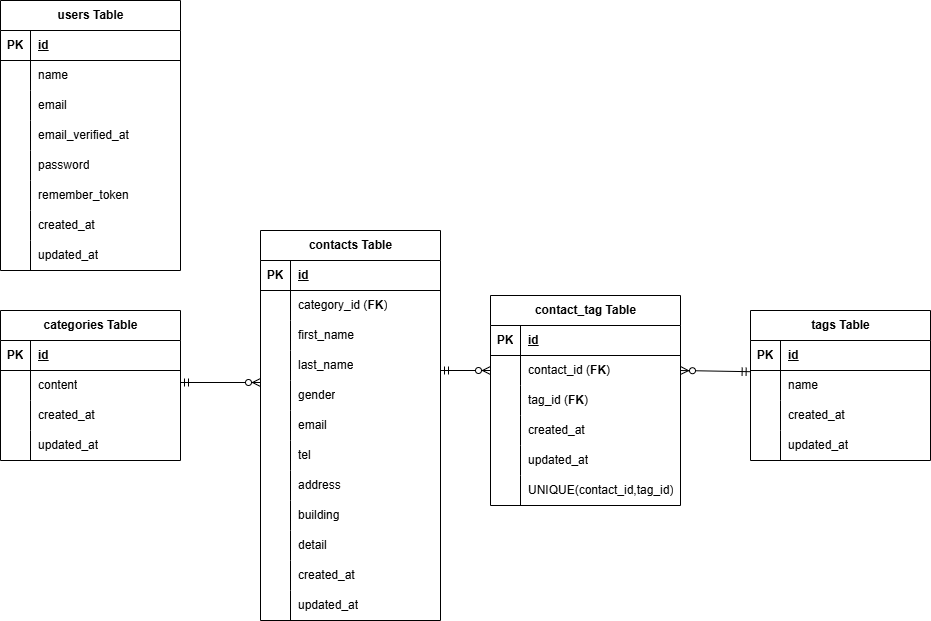

# COACHTECHお問い合わせフォーム

## 概要

お問い合わせフォームを管理するアプリケーションです。
一般ユーザーはお問い合わせを送信することができ、管理者はログイン後にお問い合わせの一覧の確認、検索、削除、タグ管理を行うことができます。

## ER図



- categoriesテーブル 1:多 contactsテーブル
- contactsテーブル 多:多 tagsテーブル
- usersテーブル リレーションなし

## 環境構築手順

- DockerとDocker Composeを使用して環境をコンテナ化する

### Laravelプロジェクトの作成(Laravel 10.x)

以下のDockerコマンドを実行して、Laravel 10.xを明示的に指定してプロジェクトを作成。

```
  docker run --rm \
   -u "$(id -u):$(id -g)" \
   -v "$(pwd):/var/www/html" \
   -w /var/www/html \
   -e COMPOSER_CACHE_DIR=/tmp/composer_cache \
   laravelsail/php82-composer:latest \
   composer create-project laravel/laravel:^10.0 contact-form-app
```

### Laravel Sailのインストール

- プロジェクトディレクトリに移動
  `cd contact-form-app`
- Laravel Sailをインストール
  以下のコマンドを実行

```
  docker run --rm \
   -u "$(id -u):$(id -g)" \
   -v "$(pwd):/var/www/html" \
   -w /var/www/html \
   -e COMPOSER_CACHE_DIR=/tmp/composer_cache \
   laravelsail/php82-composer:latest \
   composer require laravel/sail --dev
```

- Sailの設定ファイルをパブリッシュ(MySQLを選択)
  以下のコマンドを実行

```
  docker run --rm \
   -u "$(id -u):$(id -g)" \
   -v "$(pwd):/var/www/html" \
   -w /var/www/html \
   -e COMPOSER_CACHE_DIR=/tmp/composer_cache \
   laravelsail/php82-composer:latest \
   php artisan sail:install --with=mysql
```

- M1/M2/M3 Mac(Apple Silicon)をお使いの方

    Apple Silicon搭載のMacでは、`sail up -d`実行時に以下のエラーが発生することがあります：

```
no matching manifest for linux/arm64/v8
```

解決方法: `compose.yaml`を開き、mysqlサービスに`platform: 'linux/amd64'`を追加してください。

```
mysql:
    image: 'mysql/mysql-server:8.0'
    platform: 'linux/amd64'  # ← この行を追加
    ports:
```

### .envファイルの設定確認

.envファイルを開き、データベース接続情報が以下と一致していることを確認

```
    DB_CONNECTION=mysql
    DB_HOST=mysql
    DB_PORT=3306
    DB_DATABASE=laravel
    DB_USERNAME=sail
    DB_PASSWORD=password
```

### フロントエンドのセットアップ(Vite&Tailwind CSS)

- NPM依存パッケージのインストール

    Sailコンテナが起動していることを確認し
    `sail npm install`を実行

- Tailwind CSSのインストール

    `sail npm install -D tailwindcss@^3.4.0 postcss autoprefixer`

    `sail npm install alpinejs`

- 設定ファイルの生成

    `sail npx tailwindcss init -p`

- Tailwind CSSのテンプレートパス設定

    tailwind.config.js を開き、以下のように設定

```
  /** @type {import("tailwindcss").Config} */
  export default {
   content: [
    "./resources/**/*.blade.php",
    "./resources/**/*.js",
    "./resources/**/*.vue",
  ],
   theme: {
    extend: {},
  },
   plugins: [],
  }
```

- 提供リポジトリのresourcesディレクトリと入れ替え

    以下のリポジトリをクローンし、resourcesディレクトリを丸ごと入れ替える。

```
  git clone https://github.com/coachtech-prepared-file/Preparedblade-ConfirmationTest-ContactForm.git
```

入れ替え手順:

1. Finderでプロジェクトフォルダを開く。
   `open .`
2. プロジェクト内の resources フォルダを削除。
3. クローンしたリポジトリ内の resources フォルダをプロジェクト直下にコピー。

- Vite開発サーバーの起動

    `sail npm run dev`(実行したままにしておく)

### phpMyAdminの追加

- `compose.yaml` を開き、mysql サービスの後に以下の設定を追加。

```
   phpmyadmin:
     image: 'phpmyadmin:latest'
     ports:
        -'${FORWARD_PHPMYADMIN_PORT:-8080}:80'
     environment:
        PMA_HOST: mysql
        PMA_USER: '${DB_USERNAME}'
        PMA_PASSWORD: '${DB_PASSWORD}'
     networks:
        - sail
     depends_on:
        - mysql
```

### Sailの起動とエイリアス設定

- Sailをバックグラウンドで起動

    `./vendor/bin/sail up -d`

- エイリアスを設定して 'sail' だけでコマンドを実行できるようにする

```
echo "alias sail='[ -f sail ] && bash sail || bash vendor/bin/sail'" >> ~/.zshrc
```

※ bashの場合

```
echo "alias sail='[ -f sail ] && bash sail || bash vendor/bin/sail'" >> ~/.bashrc
```

- シェルを再起動するか、新しいターミナルを開いてエイリアスを有効にする

    `exec $SHELL`

### アプリケーションキーの生成

以下のコマンドを実行する

`sail artisan key:generate`

### データベースのマイグレーションと初期データ投入

- 以下のコマンドでテーブルを作成し初期データを投入する

    `sail artisan migrate --seed`

## 使用技術

- OS(Dockerが動作する任意のOS)
- PHP 8.2
- Laravel 10.x
- DB: MySQL 8.0
- Webサーバー: Nginx
- フロントエンド: Vite, Tailwind CSS ^3.4.0
- 開発ツール: Docker, Laravel Sail, phpMyAdmin
- Blade テンプレート

## 主な機能

### 認証機能

- 管理者登録
- ログイン
- ログアウト

### お問い合わせ機能

- お問い合わせ送信
- 入力内容確認
- サンクスページ表示

### 管理機能

- お問い合わせ一覧表示
- お問い合わせ検索
- お問い合わせ詳細表示
- お問い合わせ削除
- CSVのエクスポート
- タグ管理一覧
- タグ登録
- タグ管理
- タグ編集
- タグ削除

## APIエンドポイント一覧

- **お問い合わせ一覧取得**

| Method | URL              |
| :----- | :--------------- |
| GET    | /api/v1/contacts |

リクエストパラメータ

| パラメータ  | 内容                |
| :---------- | :------------------ |
| keyword     | キーワード検索      |
| gender      | 性別                |
| category_id | お問い合わせ種類    |
| date        | 作成日              |
| page        | ページ番号          |
| per_page    | 1ページあたりの件数 |

- **お問い合わせ詳細取得**

| Method | URL                        |
| :----- | :------------------------- |
| GET    | /api/v1/contacts/{contact} |

- **お問い合わせ作成**

| Method | URL               |
| :----- | :---------------- |
| POST   | /api/v1/contacts/ |

- **お問い合わせ更新**

| Method | URL                        |
| :----- | :------------------------- |
| PUT    | /api/v1/contacts/{contact} |

- **お問い合わせ削除**

| Method | URL                        |
| :----- | :------------------------- |
| DELETE | /api/v1/contacts/{contact} |

## 動作確認

### コンテナ起動

`sail up -d`

### マイグレーション・シーディング実行

`sail artisan migrate:fresh --seed`

### Vite起動

`sail npm run dev`

### アクセス

- トップページ
  `http://localhost`
- phpMyAdmin
  `http://localhost:8080`

### ログイン確認

以下のテストユーザーでログインできます

| メールアドレス   | パスワード |
| :--------------- | :--------- |
| test@example.com | password   |

※ UserSeederで作成したユーザーです

### 機能確認

- お問い合わせフォーム

1. トップページへアクセス
2. 必須項目を入力
3. 確認画面へ遷移
4. 送信
5. サンクスページ表示

- 管理画面

1. ログイン
2. /adminにアクセス
3. お問い合わせ一覧表示を確認
4. 検索機能を確認
5. 詳細表示を確認
6. 削除機能を確認
7. エクスポートボタンでデータをCSVとしてダウンロード(検索条件で絞り込める)

- タグ管理

1. タグ一覧表示
2. タグ新規作成
3. タグ編集
4. タグ削除

## テスト

### テスト実行

`sail artisan test`

2 deprecated, 63 passed

### テストカバレッジ

`sail artisan test --coverage`

実行結果 87.1%

## 環境開発URL

http://localhost

## 作成者

宮古澄佳
